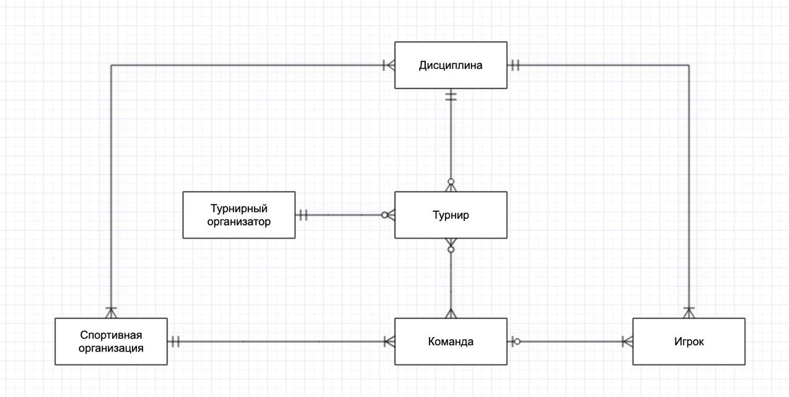
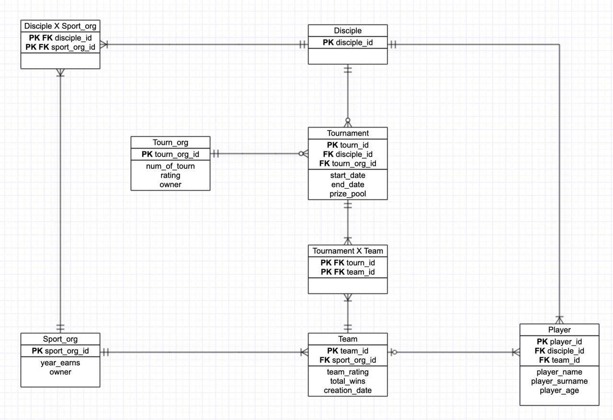

# 1
Область: Киберспорт

Сущности:

- Дисциплина - конкретная игра, по которой проводятся турниры
- Турнир - мероприятие с призовым фондом и командами
- Организатор турниров - есть определенный список организация, которые занимаются подавляющей частью турниров
- Спортивная организация - определенный тэг под которым выступают команды, зачастую несколько команд из разных дисциплин
- Команда - конкретная команда по конкретной дисциплине
- Игрок - игрок

Заранее стоит уточнить версионность. Самое подходящее сделать таблицу “Команда” версионной

# 2

#### a. 

#### b. 

#### c.
| **Disciple** |                |                           |          |                |
|--------------|----------------|---------------------------|----------|----------------|
| **PK/FK**    | **Name**       | **Description**           | **Type** | **Constraint** |
| PK           | disciple_id    | Киберспортивная дисцплина | INTEGER  | PRIMARY KEY    |

| **Disciple X Sport_org** |                 |                           |          |                  |
|--------------------------|-----------------|---------------------------|----------|------------------|
| **PK/FK**                | **Name**        | **Description**           | **Type** | **Constraint**   |
| PK FK                    | disciple_id     | Киберспортивная дисцплина | INTEGER  | FK ref Disciple  |
| PK FK                    | sport_org_id    | Спортивная организация    | INTEGER  | FK ref Sport_org |

| **Sport_org** |                |                           |          |                |
|---------------|----------------|---------------------------|----------|----------------|
| **PK/FK**     | **Name**       | **Description**           | **Type** | **Constraint** |
| PK            | sport_org_id   | Спортивная организация    | INTEGER  | PRIMARY KEY    |

| **Tournament** |                |                           |          |                       |
|----------------|----------------|---------------------------|----------|-----------------------|
| **PK/FK**      | **Name**       | **Description**           | **Type** | **Constraint**        |
| PK             | tourn_id       | Турнир                    | INTEGER  | PRIMARY KEY           |
| FK             | disciple_id    | Киберспортивная дисцплина | INTEGER  | FK ref Disciple       |
| FK             | tourn_org_id   | Организатор турниров      | INTEGER  | FK ref tourn_org      |
|                | start_date     | Дата начала турнира       | DATE     | NOT NULL              |
|                | end_date       | Дата конца турнира        | DATE     | NOT NULL              |
|                | prize_pool     | Размер призовых           | INTEGER  | prize_pool > 0        |

| **Tourn_org** |                |                               |          |                  |
|---------------|----------------|-------------------------------|----------|------------------|
| **PK/FK**     | **Name**       | **Description**               | **Type** | **Constraint**   |
| PK            | tourn_org_id   | Организатор турнира           | INTEGER  | PRIMARY KEY      |
|               | num_of_tourn   | число организованных турниров | INTEGER  | num_of_tourn > 0 |
|               | rating         | рейтинг турниров              | REAL     | 0 < rating < 5   |
|               | owner          | Владелец организации          | STRING   |                  |

| **Tournament X Team** |                 |                           |          |                |
|-----------------------|-----------------|---------------------------|----------|----------------|
| **PK/FK**             | **Name**        | **Description**           | **Type** | **Constraint** |
| PK FK                 | tourn_id        | Турнир                    | INTEGER  | FK ref tourn   |
| PK FK                 | team_id         | Киберспортивная команда   | INTEGER  | FK ref team    |

| **Team**      |                     |                                       |          |                  |
|---------------|---------------------|---------------------------------------|----------|------------------|
| **PK/FK**     | **Name**            | **Description**                       | **Type** | **Constraint**   |
| PK            | team_id             | Киберспортивная команда               | INTEGER  | PRIMARY KEY      |
| FK            | sport_org_id        | Спортивная организация                | INTEGER  | FK ref sport_org |
|               | team_rating         | Соревновательный рейтинг              | INTEGER  | team_rating > 0  |
|               | total_wins          | Число побед в турнирах                | INTEGER  | total_wins > 0   |
|               | creation_date       | Дата создания команды                 | DATE     |                  |
|               | valid_from_dttm     | дата появления записи                 | DATE     | NOT NULL         |
|               | valid_to_dttm       | дата появления следующей после записи | DATE     | NOT NULL         |

Изменение тут ^

| **Player**    |                |                           |          |                 |
|---------------|----------------|---------------------------|----------|-----------------|
| **PK/FK**     | **Name**       | **Description**           | **Type** | **Constraint**  |
| PK            | player_id      | Игрок                     | INTEGER  | PRIMARY KEY     |
| FK            | disciple_id    | Киберспортивная дисцплина | INTEGER  | FK ref disciple |
| FK            | team_id        | Команда                   | INTEGER  | FK ref team     |
|               | player_name    | Имя игрока                | STRING   | NOT NULL        |
|               | player_surname | Фамилия игрока            | STRING   | NOT NULL        |
|               | player_age     | Возраст игрока            | INTEGER  | player_age > 0  |

